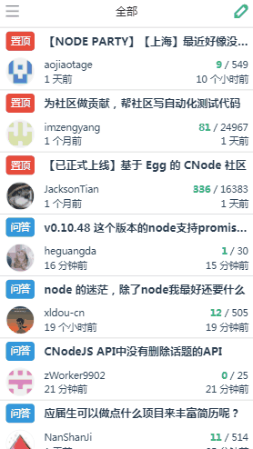
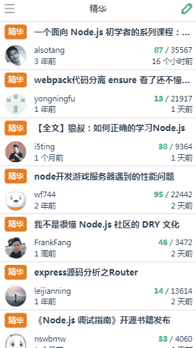

# 用Vue.js重写的cnode社区
用Vue.js，基于cnode的公共api打造的开源cnode社区webapp，实现了异步分页加载浏览、登录、用户中心等功能。
## 预览



<br>
在线预览地址：[https://hunterfront.github.io/vue-mycnode/dist/#/](https://hunterfront.github.io/vue-mycnode/dist/#/)
<br>
移动端扫码食用效果更佳:
<br>

## 技术栈
- vue-cli：一键安装vue2全家桶
- vue2：前台页面的实现，各种组件的编写
- vue-router2：实现路由配置
- vuex：对共享状态进行管理，主要是对登录状态的管理
- axios：一个基于Promise的HTTP库，对其进行封装，用于向后端发起请求获取数据
- es6语法：箭头函数、let、const、扩展运算符、属性简写、解构赋值等等。
- sessionStorage：保存用户登录状态和相关数据。
- webpack:对项目进行打包，打包到子目录时路径的配置很重要。
- SCSS：css预处理。
- flex：flex布局，简单好用，几乎万能。
## 总结
1. 当组件嵌套比较复杂或者许多个组件共享一个状态的时候，用vuex十分合适，如果共享的状态不是很复杂也可以考虑用global-event-bus解决
2. 事先要对项目有一个整体的把握，搞清楚要编写哪些页面和组件，以及它们之间的关系，要传递的数据有什么等等
3. 使用vue-router的时候要搞清楚路由守卫的应用时机，同时也要清楚vue的生命周期，这样才能在合适的时机做出何时的操作
4. 工具函数utils的使用可以绑定到Vue.prototype上，这样免去的在每个组件中import的麻烦，直接可以在实例中使用


## Build Setup

``` bash
# install dependencies
npm install

# serve with hot reload at localhost:8080
npm run dev

# build for production with minification
npm run build

# build for production and view the bundle analyzer report
npm run build --report
```

For a detailed explanation on how things work, check out the [guide](http://vuejs-templates.github.io/webpack/) and [docs for vue-loader](http://vuejs.github.io/vue-loader).
